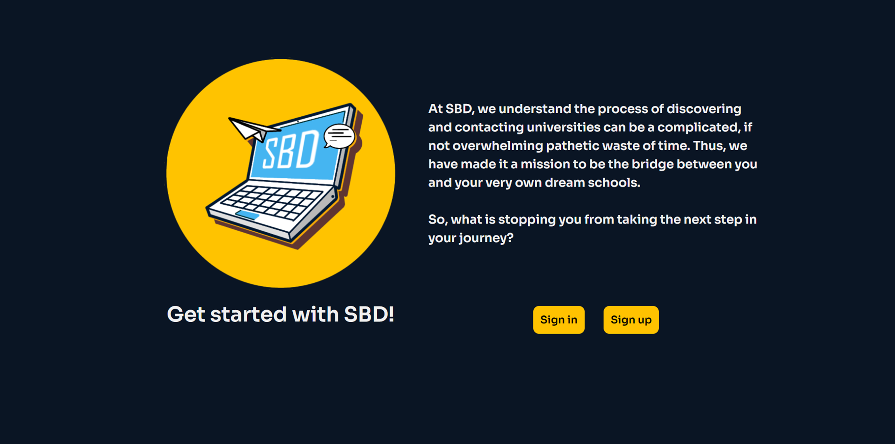
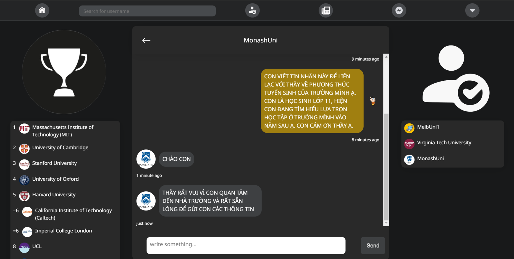
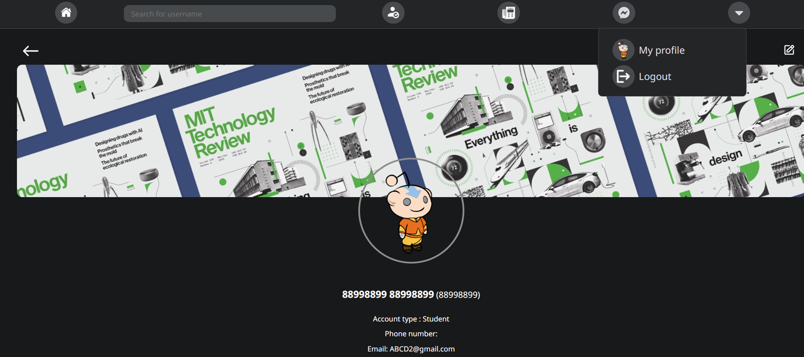
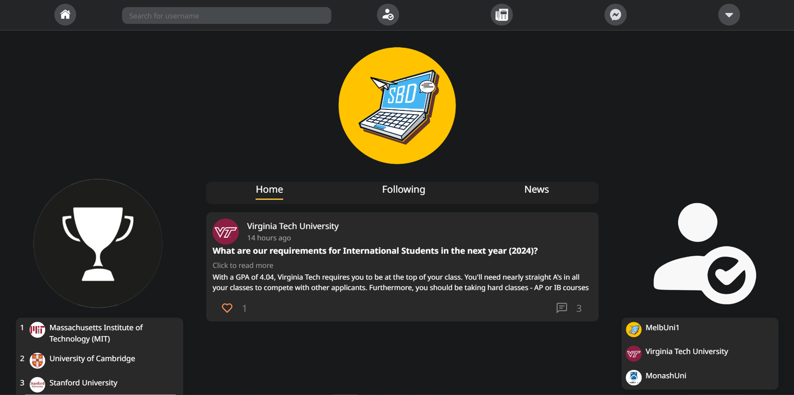

# School Bridgers' Direct

School Bridgers' Direct is a social networking platform designed to connect high school students (grades 10-12) with universities. It functions like a typical social media platform, offering features such as real-time messaging, posts, and the ability to follow schools, enhanced with external data on university rankings and education news.

## Table of Contents

1. [Overview](#overview)
2. [Features](#features)
3. [Technology Stack](#technology-stack)
4. [External APIs](#external-apis)
5. [Installation](#installation)
6. [Usage](#usage)
7. [Contributing](#contributing)

## Overview

School Bridgers' Direct aims to bridge the gap between high school students and universities, providing a platform for interaction, information sharing, and networking. This project incorporates external data sources to provide up-to-date information on university rankings and education news, enhancing the user experience and providing valuable insights to students.

## Features

- Real-time messaging between users
- Post creation and sharing
- Ability to follow schools and other users
- User profiles for both students and university representatives
- Search functionality for schools and users
- Integration of university rankings from external API
- Latest education news feed
- Personalized university recommendations based on user preferences and rankings

## Technology Stack

- Frontend: React
- Backend: Express.js
- Database: MongoDB
- External APIs: University Rankings API, Education News API

## External APIs

The project utilizes the following external APIs to enhance its functionality:

1. University Rankings API: Provides up-to-date global university rankings.
   - API Provider: [Specify the provider, e.g., QS World University Rankings]
   - Documentation: [Link to API documentation]

2. Education News API: Delivers the latest news and updates in the education sector.
   - API Provider: [Specify the provider, e.g., NewsAPI]
   - Documentation: [Link to API documentation]

## Installation

To set up the project locally, follow these steps:

1. Clone the repository:
git clone https://github.com/yourusername/school-bridgers-direct.git

2. Navigate to the project directory:
cd sbd

3. Install dependencies for both frontend and backend:
cd frontend
npm install
cd ../backend
npm install

4. Set up environment variables:
- Create a `.env` file in the backend directory
- Add necessary configurations (MongoDB URI, JWT secret, API keys for external APIs)

5. Start the backend server:
cd backend
npm start

6. In a new terminal, start the frontend:
cd frontend
npm start

## Usage

After installation, access the application by opening a web browser and navigating to `http://localhost:3000` (or your configured frontend port).

To use the external API features:
1. Navigate to the University Rankings section to view global university standings.
2. Check the Education News feed for the latest updates in the education sector.
3. Explore personalized university recommendations based on your profile and interests.

## Contributing

Contributions to improve School Bridgers' Direct are welcome. Please feel free to fork the repository, make changes, and submit a pull request.

---

Note: This project is a prototype and may contain suboptimal code practices as it was one of the developer's